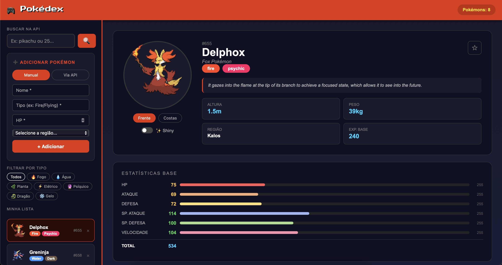

# Pokedex Interativa

Uma aplicação web inspirada na Pokedex do universo Pokémon, desenvolvida com foco em prática de desenvolvimento front-end e manipulação de dados.

---

## Preview



---

## Demonstração

🔗 https://theogoulart333.github.io/pokedex/

---

## Repositório

🔗 https://github.com/TheoGoulart333/pokedex

---

## Tecnologias utilizadas

- HTML5 (estrutura semântica)
- CSS3 (estilização e layout)
- Python (lógica e manipulação de dados)

---

## Objetivo do projeto

Este projeto foi desenvolvido com o objetivo de:

- Praticar a construção de interfaces web
- Simular uma aplicação real inspirada em produtos conhecidos
- Trabalhar organização e estrutura de código
- Evoluir habilidades em front-end

---

## Funcionalidades

- Busca de Pokémon  
- Exibição de informações (nome, tipo, imagem, etc.)  
- Interface inspirada na Pokedex clássica  
- Layout adaptável  

---

## Aprendizados

Durante o desenvolvimento, tive foco em:

- Estruturação de páginas com HTML
- Estilização com CSS moderno
- Organização de código
- Boas práticas de desenvolvimento

---

## Como executar o projeto

```bash
# Clone o repositório
git clone https://github.com/TheoGoulart333/pokedex.git

# Acesse a pasta
cd pokedex

# Abra o arquivo no navegador
pokedex.html
